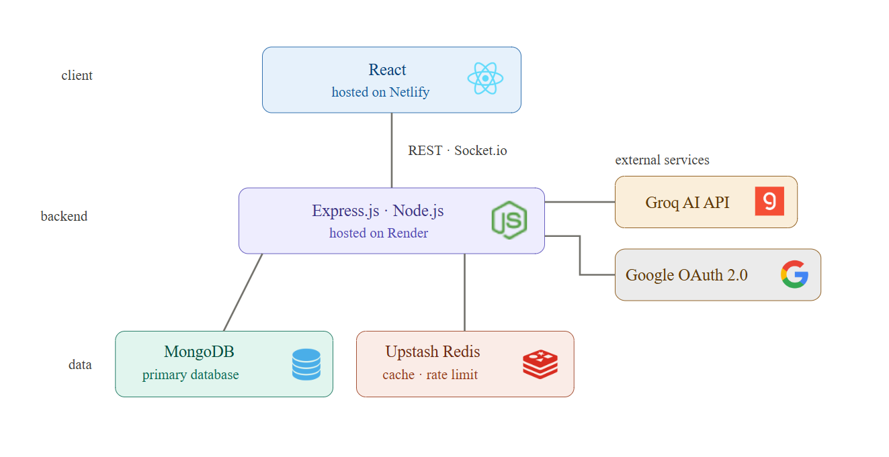
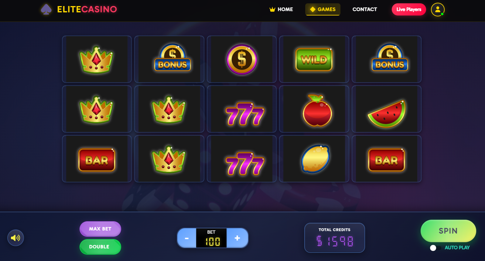
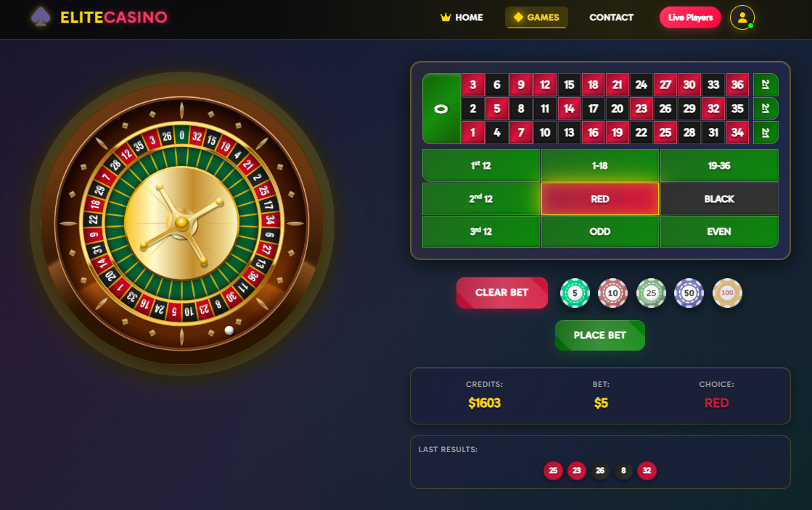

# 🎰 Elite Casino

**A production-grade full-stack casino platform built to demonstrate senior-level engineering from system design to real-time infrastructure.**

[🎮 Live Demo](https://elite-casino.netlify.app/) · [📖 API Docs (Swagger)](https://online-casino.onrender.com/server/docs/)

---

> Elite Casino is not just a typical tutorial project, but a full-stack web application featuring live casino games, real-time communication, AI-powered assistance, Google OAuth, versioned REST APIs, Redis caching, and a CI/CD pipeline, all built with the architecture decisions and code quality you'd expect from a professional engineering team.

> [!WARNING]
> **This is NOT a real gambling site and I'm strongly against gambling.** This project serves purely as a technical sandbox to demonstrate my technical skills and explore new technologies. A casino platform was chosen as the domain because it naturally demands complex logic, real-time systems, and a wide range of technical challenges, nothing more.

## 📋 Table of Contents

- [1. Architecture](#️-architecture-diagram)
- [2. Features](#-features)
- [3. Games](#-games)
  - [3.1 Slot Machine](#-slot-machine)
  - [3.2 Roulette](#-roulette)
- [4. Under the Hood](#️-under-the-hood)
  - [4.1 Frontend](#️-frontend)
  - [4.2 Backend](#️-backend)
- [5. Challenges & Solutions](#-challenges-i-faced--solutions)
- [6. What I've Learned](#-what-ive-learned)

## 🏗️ Architecture diagram

  

## ✨ Features

### 🔐 Authentication & Authorization
- Secure **JWT-based** authentication with protected routes
- **Google OAuth 2.0** sign-in for frictionless onboarding
- Guest access with limited functionality across the platform

### 📊 Dashboard
- Personal stats - total credits wagered, total wins, total rounds played, favorite game
- Recent activity feed and full game history
- Personal info display

### 🎮 Games
- Two fully interactive casino games - **Slots** and **Roulette**
- Each game features custom logic, dynamic UI and persistent history

### 👥 Social & User Interaction
- **Live users panel** displaying currently online players
- View other users' profiles, send direct messages or block them

### 💬 Real-time Communication
- **Direct private messaging** between online users powered by WebSockets
- Fully live, no page refresh needed, instant delivery

### 🤖 AI Chatbot Assistant
- Integrated live chatbot powered by **Groq AI**
- Provides mostly casino tips, game guidance and general site assistance
- Different experience for guests vs authenticated users
- Has example questions

### 📧 Contact & Notifications
- Contact form with **real email delivery**
- Toast notifications and real-time UI feedback throughout the app

### 🎨 UI & UX
- Fully **responsive** across all screen sizes
- Smooth **animations**, **skeleton loaders** and intuitive navigation

## 🎮 Games

### 🎰 Slot Machine

The slot machine is a fully custom-built game with no libraries and templates. Every part of the logic, from reel generation to win calculation, is written from scratch.

#### How it works

The game board consists of a **3×5 grid** — 3 rows and 5 columns of symbols. Each symbol is one of 12 possible values, visually represented as classic slot imagery (fruits, sevens, card signs and more. Underneath every visual, a number from 1 to 12 maps to a specific symbol and its associated payout tier.

When the player hits the **Spin**  button , a single POST request is sent to the backend carrying only the `betAmount`. Everything else happens server-side. The entire game outcome is determined server-side, making it impossible to manipulate from the browser.

#### Server side logic

All game logic lives inside a dedicated `SlotsService` class, keeping it fully decoupled from the controller layer. The controller receives the request, extracts the user ID from the JWT middleware and the bet amount from the request body, and hands both off to the service. From that point on, `SlotsService` takes over and runs through a strict sequence of steps:

1. **Validation** - `validateBet()` ensures the bet is a valid number within the allowed range (100–1000 credits). Invalid or out-of-range bets are rejected before anything else runs and will throw an error.
2. **Balance check** - the user's current credits are verified against the bet amount. Insufficient funds throw an early error.
3. **Reel generation** - `generateSlotReels()` produces a new 2D Array of 3×5 grid of random integers from 1 to 12.
4. **Win calculation** - `calculateWin()` evaluates all **9 paylines** across the grid - three straight rows, two diagonals, V and inverted V patterns, and two zigzag lines. Each payline is checked with `checkPayLine()`, which counts consecutive matching symbols left to right from the first position.
5. **Payout** - `getMultiplier()` determines the payout for each winning combination based on both the symbol's tier and the number of consecutive matches (2 through 5). A 5-of-a-kind Diamond pays 100× the bet; a 2-of-a-kind King pays 0.1×. Multiple winning paylines stack, so the total multiplier is the sum of all active lines.
6. **Database update** - the user's balance, total wagered, total won and games played are updated atomically in a single `$inc` operation.
7. **History & transactions** - in production, two additional DB writes happen - a `GameHistory` record is created for the round and separate `Transaction` records are written for the bet and, if applicable, the win. In development this is skipped to keep the database clean.
8. **Cache invalidation** - after every round, some Redis keys for user data are invalidated so the dashboard always reflects fresh data on the next request.

A single comprehensive response object - reels, winning lines, multiplier, net profit, new balance is returned to the client in one response.

#### Client experience

While the server side processes the round, the frontend runs a **reel spinning animation**, mimicking a real slot machine. When the response arrives, the animation resolves to display the actual results. If its a winning round, it triggers a **win animation** and a **sound effect**.

Additional player controls:

- **Auto Play** - automatically triggers the next spin as soon as the current round completes, without manual input
- **Max Bet / Double Bet** - quick-set buttons for common bet adjustments
- **Sound toggle** - mute and unmute sound during play

  

---

### 🎡 Roulette

The roulette game is a digital recreation of European roulette, built entirely from scratch with a full suite of real betting options, server-side outcome generation and frontend animation sequence. 

#### Game board

It has an interactive game board featuring 37 numbers - **0 through 36**  Each number cell is coloured according to the standard roulette table: red, black and green for zero. The player selects their bet type by clicking directly on the board, then builds their stake using physical chip buttons.

#### Bet types

The game supports the full range of standard roulette bets:

| Bet Type | Description | Payout |
|----------|-------------|--------|
| Single Number | Any specific number from 0 to 36 | **35:1** |
| Red / Black | All red or all black numbers | **1:1** |
| Odd / Even | All odd or all even numbers (0 excluded) | **1:1** |
| Low / High | 1–18 or 19–36 | **1:1** |
| 1st Dozen | Numbers 1–12 | **2:1** |
| 2nd Dozen | Numbers 13–24 | **2:1** |
| 3rd Dozen | Numbers 25–36 | **2:1** |

The player can toggle a selection off by clicking it again, and cannot change the bet or place a new one while the wheel is spinning.

#### Chip system

Rather than typing in an amount, the player places their bet using **5 chip denominations**: 5, 10, 25, 50 and 100 credits. Each click on a chip adds its value to the current bet.

#### Placing the bet - what happens and when

When the player clicks **Place Bet**, the frontend runs a series of validations locally before any network request is made. If any check fails, no request is sent.

If everything is valid, the player's displayed credit balance is **immediately decremented** by the bet amount on the frontend, giving instant visual feedback before the server responds. The request is then sent to the backend with three values: `betAmount`, `betType` and `betValue` (the specific number, if applicable).

#### Server side logic

All game logic lives inside a dedicated `RouletteService` class, following the same architectural pattern as `SlotsService` -  decoupled from the controller layer, instantiated as a singleton and exported as a single instance.

**Step 1 - Bet validation (`validateBet`)** - The incoming bet is validated against a strict allowlist of valid bet types

**Step 2 - User validation and balance check** - this step calls a shared helper — `validateUserAndCredits()` . It fetches the user, throws a 404 if not found, and throws a 400 if the balance is insufficient.

**Step 3 - Spin result generation** - `generateResult()` generates a random integer between 0 and 36 using `Math.random()`, then determines its colour by checking it against the hardcoded `RED_NUMBERS` and `BLACK_NUMBERS` arrays.

**Step 4 - Win calculation** - `calculateWin()` receives the spin result, the bet type, the bet value and the bet amount. Every possible bet type is evaluated:
- `number` — wins only if `randNumber === betValue`
- `red` / `black` — wins if the result colour matches
- `even` / `odd` — wins if the number matches parity, with 0 explicitly excluded
- `low` / `high` — wins if the number falls within 1–18 or 19–36
- `first_dozen` / `second_dozen` / `third_dozen` — wins based on the number's range

The final win amount is calculated as `betAmount × (multiplier + 1)` — the `+1` returns the original stake along with the profit, matching standard casino payout convention.

**Step 5 - Database update** - The user's record is updated with a single atomic `$inc` operation.

**Step 6 - Game history and transactions (production only)** -Identical pattern to the slots game.

**Step 7 — Logging the outcome and cache invalidation**

The full result object is returned: spin result, bet details, isWin, winAmount, multiplier, net profit and the balance before and after.

#### Client side animation sequence

The frontend runs a timed multi-stage animation sequence  to feel like watching a real roulette wheel slow down and settle.

1. **Wheel starts spinning** - immediately on click, the wheel animation begins.
2. **Request fires**
3. **Ball enters** - 1.5 seconds after the response arrives, the ball rolling sound plays and the ball animation starts.
4. **Wheel slows** - 6 seconds later, the wheel spinning animation stops, simulating the wheel decelerating.
5. **Ball settles** - 2 seconds after that, the ball animation stops and the result is revealed. The ball audio fades out gracefully.
6. **Win sequence** - if the round is a win, a win sound plays, followed 1.5 seconds later by a coin payout sound and an animated credit increment that counts the balance up from its current value to the new total.
7. **Board resets** - 3 seconds after the result is shown, the result clears and the board is ready for the next round.

If the request fails at any point, the balance is restored to its pre-bet value, the spinning state is cleared and an error toast is displayed, leaving a clean state.

#### Last results panel

Below the board, a **Last Results** strip displays the outcomes of recent rounds as coloured bubbles - red, black or green.

  

## ⚙️ Under the Hood

### 🖥️ Frontend

- **React 18** - Plain React project (No Next.js in this one) build with Vite. Basic component-based architecture. The project was started on v18 and will be upgraded in a future iteration.

- **React Router** - The default react project library for routing when the project is in plain React and has no Next.js with app router. Enables a seamless SPA experience by mapping UI components to specific URL paths without full page reloads.

- **Redux Toolkit** for global state management. Chosen over alternatives like Context API or Zustand because the app has genuinely complex shared state - authenticated user data, balance, modals, games statem, socket connection status, that needs to be accessible and updatable from many parts of the component tree. Redux Toolkit removes the traditional Redux boilerplate while keeping the structure and predictability that scales well. The access token is stored in Redux state intentionally, not in `localStorage` — to avoid XSS exposure.

- **TanStack React Query** for server state management, Handling fetching, caching, background refetching and synchronization with the server. Rather than manually managing loading/error states with `useEffect` (still done like that in some parts of the project at the beginning), React Query provides a clean and declarative approach that also reduces unnecessary network requests through its built-in caching layer. Used alongside Redux, not instead of it and each handles a different concern.

- **Axios** with a custom interceptor that silently refreshes expired access tokens and retries the original failed request. This keeps the session seamless and avoids forcing the user to log in again mid-session.

- **Socket.io client** for real-time private messaging, kept in sync with the backend Socket.io server. The connection lifecycle is managed carefully to avoid duplicate connections or memory leaks across re-renders.

- **SASS/SCSS** for styling. Chosen primary for its convenient nesting and color constants variables, which make managing a large stylesheet across many components significantly more maintainable than plain CSS.

- **Vitest** for unit testing, with approximately 70% code coverage. Vitest was chosen over Jest for the frontend because it integrates natively with Vite, runs significantly faster, and supports ESM out of the box — no extra configuration needed.

---

### 🛠️ Backend

- **Node.js 22** with **Express 4** - RESTful API following a clean, versioned route structure (`/server/v1/...`). I tried to follow production standard practices and introduced api versioning, because it ensures that future breaking changes can be introduced under `/api/v2/...` without affecting existing clients.

- **MongoDB Atlas** via Mongoose for data persistence, hosted on the free tier cloud cluster. MongoDB was chosen because the data in this application (user profiles, game data, history, chat messages) is naturally document-shaped and varies per record, making a flexible schema a better fit than a rigid relational one.

- **Upstash Redis** for two distinct purposes:
  - **Caching** - mostly dashboard statistics and frequently-read user data are cached in Redis to avoid hitting MongoDB on every request. This is especially relevant for data that is read often but changes infrequently, such as a user profile stats.
  - **Rate limiting** - the rate limiter is Redis-backed rather than in-memory. An in-memory rate limiter resets on every server restart and breaks under horizontal scaling. By storing rate limit counters in Redis, the system is both restart-resistant and distributed-ready, exactly how it would be done in a real production environment.

- **JWT authentication** with a basic dual-token strategy - short-lived access tokens and long-lived refresh tokens. The access token lives in Redux state on the frontend (NOT `localStorage`), and the refresh token is stored in an HTTP-only cookie, making it inaccessible to JavaScript entirely. When the access token expires, an Axios interceptor automatically calls the refresh endpoint, obtains a new token, and retries the original request.

- **Socket.io** for real-time private messaging on the backend. Rather than a single shared chat room, each conversation is scoped between exactly two users — messages are emitted only to the intended recipient's socket. Online presence is also tracked, showing online users on the live users panel on the frontend.

- **Groq AI API** for the AI chatbot assistant. Requests are sent directly to Groq's API from the backend, keeping the API key server-side and out of the client. The chatbot context and available capabilities differ depending on whether the user is authenticated or browsing as a guest. The exact ai model used is openai/gpt-oss-20b.

- **Zod** for request validation on all incoming data. Zod schemas act as the single source of truth for what shape data is expected to be in. Invalid requests are rejected early, before they ever reach business logic or the database.

- **Multer** for handling profile picture uploads, processing multipart form data and storing the file securely before updating the user's record.

- **Nodemailer** for transactional emails, used when a user submits the contact form, triggering a real email delivery.

- **Winston** for structured logging, separating log levels (info, warn, error) and writing logs in a consistent, parseable format. Far more useful than `console.log` when debugging issues in a running application.

- **Swagger / OpenAPI** for full, interactive API documentation — available at `/server/docs/`. Every endpoint is documented with its expected request shape, parameters and possible responses. This makes the API immediately explorable and demonstrates that the project is built with real API consumers in mind.

- **Jest + Supertest** for unit and integration testing on the backend. Supertest allows full HTTP requests to be made against the Express app in a test environment, meaning endpoints are tested end-to-end including middleware, validation and database interaction, not just in isolation.

- **Docker** - separate `Dockerfile` for the frontend and backend, orchestrated with Docker Compose. Running the entire stack locally requires a single command, with no manual environment setup. Tried to follow the standard ways teams onboard new developers in professional environments.

- **CI/CD via GitHub Actions** - every push to the repository triggers an automated pipeline for both frontend and backend. Tests run first, and the deployment only proceeds if the full test suite passes. The frontend is deployed to **Netlify** and the backend to **Render**. Every change ships through a verified, automated process. No manual deployments and no "it works on my machine".

## 💪 Challenges & Solutions

---

### Live Private Chat with WebSockets

Web sockets were a completely new technology for me my the goal was not to build a simple shared chat room for everyone, which is not that complicated but a private, direct messaging system between individual users like in Messenger, WhatsApp etc..

My core challenge was: **how do I route a message to exactly one other person, persist it, and restore the full conversation history when the chat is reopened?**

The solution uses two MongoDB models working together. A `Chat` document represents a conversation between two participants. It stores their user IDs in a `participants` array and tracks the last message and last activity timestamp. A `Message` document represents a single message. It stores the `chatId`, `senderId`, `receiverId` and `content`, and is linked back to its parent `Chat`. When a user opens a conversation, the backend queries all `Message` documents where the `chatId` matches, ordered chronologically.

On the WebSocket side, each conversation gets its own Socket.io room (`chat_{chatId}`). When a user joins a chat, the server verifies that their ID is in the `participants` array before admitting them to the room, so messages are only emitted to users who actually belong to that conversation.

An additional edge case was handling **temporary chats**. That is when a user initiates a conversation for the first time and no `Chat` document exists yet. Rather than blocking the UI, a temporary chat ID (`temp_*`) is created on the frontend immediately. When the first message is sent, the server creates the real `Chat` document, saves the `Message`, and emits a `chat_created` event back to both participants with the real chat ID, at which point the frontend replaces the temporary ID with the permanent one.

The frontend manages all of this through a `chatSlice` in Redux, with socket event listeners (`private_message`, `user_typing_private`, `messages_read`, `chat_created`) registered and cleaned up inside `useEffect` hooks to avoid duplicate listeners or memory leaks across re-renders.

---

### Game Logic, Multipliers and Frontend Synchronization

I didn't use any libraries for the game logic, everything is build from scratch and that was a bit challenging. For the slot machine, the most complex part was the **win calculation engine**: evaluating 9 distinct paylines across a 3×5 grid, counting consecutive left-to-right symbol matches per line, and applying a per-symbol payout table that covers 4 match levels (2 through 5-of-a-kind) for each of 12 symbols. Multiple winning paylines stack, so the final multiplier is the sum of all active lines, which had to be carefully tested to avoid edge cases where wins were double-counted or missed.

For roulette, the challenge was more or less similar. This time it was implementing every standard bet type, plus edge cases like `even` and `odd` explicitly excluding zero, and column bets mapping to specific non-consecutive number sets.

The second half of the challenge was **synchronizing the backend response with the frontend animations**. Both games are driven by `setTimeout` chains that simulate the physical feel of the machine - reels spinning, the wheel decelerating, the ball settling. The timing had to be tuned so that animations feel natural and the result is revealed at exactly the right moment, not too early and not too late. Sound effects are layered into the same sequence.

---

### JWT Authentication and Token Refresh

Had a bit of difficulties how to exatcly setup tokens in redux state and how to keep the user signed in after his access token expires, not make him login again every 15 mins.

The access token is stored in Redux state (not in `localStorage` or `sessionStorage`, to avoid XSS exposure). The refresh token is stored in an HTTP-only cookie, so JavaScript cannot read or tamper with it. When the access token expires, any outgoing request will receive a `401` response.

The solution is an **Axios interceptor** that sits between every request and the server. When it detects a `401`, it automatically fires a silent request to the `/refresh` endpoint. If the refresh token is still valid, the server issues a new access token, the interceptor updates Redux state, and then **retries the original failed request**, all that without the user ever seeing an error or being redirected to a login page. If the refresh also fails (expired or invalid), the user is logged out.

---

### UI/UX - Animations, Sounds, Game Feel

I've not used any pre-built templates or UI libraries for the games. Everything - the slot reel grid, the roulette board layout, the chip system, the spinning animations, is built from scratch with pure React and CSS.

The biggest challenge here was that specific **game feel**: making interactions feel satisfying and responsive rather than purely functional. This meant carefully coordinating `setTimeout` chains for multi-stage animation sequences, layering sound effects at the right moments, visually reflecting intermediate states (spinning, waiting, win, loss) in the UI without causing layout shifts, and handling edge cases like what happens if the backend returns an error mid-animation, making sure the UI always recovers to a clean, playable state.

---

### Frontend Testing Setup with Vitest

That was a hassle.. Writing frontend tests for components that depend on multiple providers like Redux store, React Query, React Router, toast notifications, required very specific setup and turned out to be significantly more complex than testing isolated functions.

The solution is a custom `renderWithProviders` test utility that wraps any component in the full provider tree before rendering: a pre-configured Redux store (seeded with optional `initialState`), a `QueryClientProvider` with retries and caching disabled (so tests are fast and deterministic), a `BrowserRouter` and a `Toaster`. Every test simply calls `renderWithProviders(component, initialState)` and gets back the standard React Testing Library result plus a reference to the store for state assertions.

Alongside this, `mockUseQuery` and `mockUseMutation` helpers allow any TanStack Query hook to be replaced with a predictable mock object in unit tests, controlling the `data`, `isLoading` and `isError` states without making real network requests.

## 🎓 What I've Learned

The goal was not to build just another CRUD API with a list of endpoints that return JSON. It was to learn how things are actually done in production, at scale, by real senior engineers. To learn best practices and think in system design.

That meant deliberately choosing complexity over convenience. Some decisions in this project could be considered overengineered for its size - Redis caching, a distributed rate limiter, a lot of libraries, a full CI/CD pipeline just for some portfolio app. And that was completely intentional. The point was not to need these things, but to understand them well enough to reach for them when I do actually need them.

Here is what this project taught me:

**Production engineering principles.** Thinking about scalability, fault tolerance and maintainability from the start rather than as an afterthought. Writing code that another engineer could pick up, understand and extend, not just code that runs.

**API design as a discipline.** Designing endpoints with intention. Clear naming, consistent response shapes, versioning, validation at the boundary, proper status codes, and documentation that makes the API self-explanatory. I understood that routes that just return data is not enough.

**Testing, properly.** Writing unit and integration tests, setting up a test environment that mirrors the real application, and understanding the difference between testing implementation details and testing behaviour.

**Documentation culture.** JSDoc comments, Swagger/OpenAPI specs, this detailed README you read now. I understood that code that is well-documented is a sign of an engineer who respects the next person to read it, because that could be even future themselves.

**WebSockets and real-time systems.** An entirely new paradigm. Stateful connections, rooms, event-driven architecture, and the coordination required between server-side socket logic and client-side state management.

**DevOps fundamentals.** CI/CD pipelines with GitHub Actions taught me how professional teams ship code - automated testing as a gate, environment separation, and the discipline of never deploying something that hasn't passed a pipeline. I can now deploy frontend and backend projects to Netlify and Render confidently, and understand what is happening at each step.

**Docker and environment parity.** Containerisation was new territory. Even at surface level, it solved a real problem: the gap between "works on my machine" and "works everywhere." I think every web developer should have at least a working understanding of what is it. And now I do.

**Rate limiting and security thinking.** Especially on a system like this, rate limiting is crucial. Understanding why it needs to be Redis-backed rather than in-memory, to survive restarts and work across distributed instances, was a meaningful shift in how I think about security.

**Caching strategy.** Knowing what to cache, for how long, and when to invalidate it. Redis taught me that caching is an architectural decision with real tradeoffs and not just a performance trick.

**Full-stack system thinking.** Working alone across an entire stack forces you to hold the whole system in your head. How the frontend state connects to the API, how the API connects to the data layer, how the data layer connects back to the user experience. That kind of end-to-end ownership sharpens architectural thinking in a way that working on one layer alone never does. That is what I like about being a fullstack developer.

**Frontend depth.** Complex Redux state management, React Query server state, coordinated animation sequences, custom test utilities really pushed my understanding of React and state-driven component based libraries/frameworks as a whole.

---

Every project leaves you more capable than when you started. This one left me significantly more capable and significantly more aware of how much there still is to learn, which scares me a bit, but I believe it is exactly the right feeling to finish with.

---

*Thank you for taking the time to read through this. I genuinely hope it gave you a clear picture of both the project and the thinking behind it. If anything caught your eye or you'd like to talk about the work, feel free to reach out, I'd love the conversation.*
